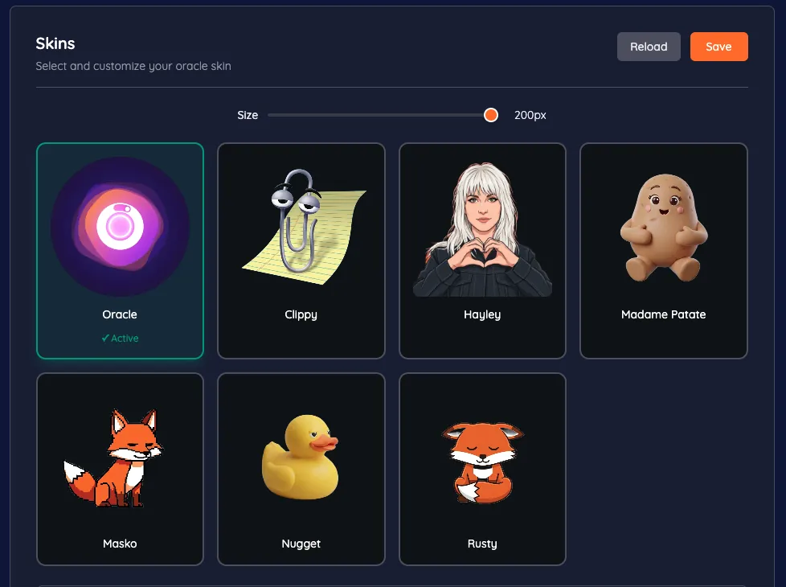
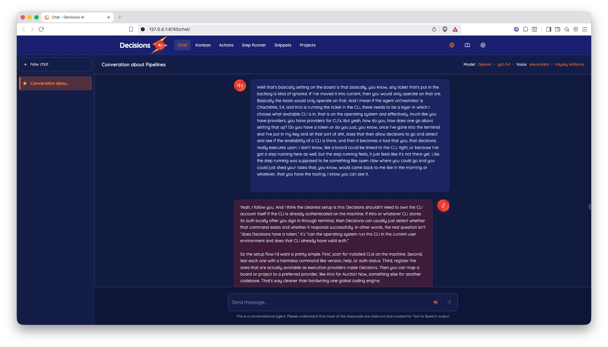
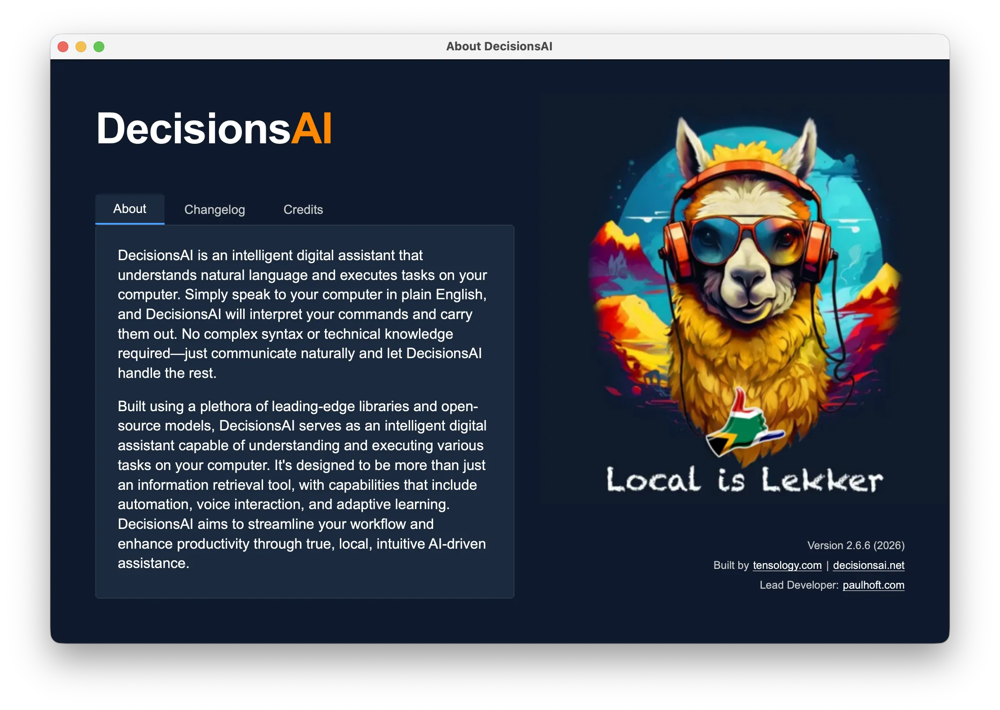
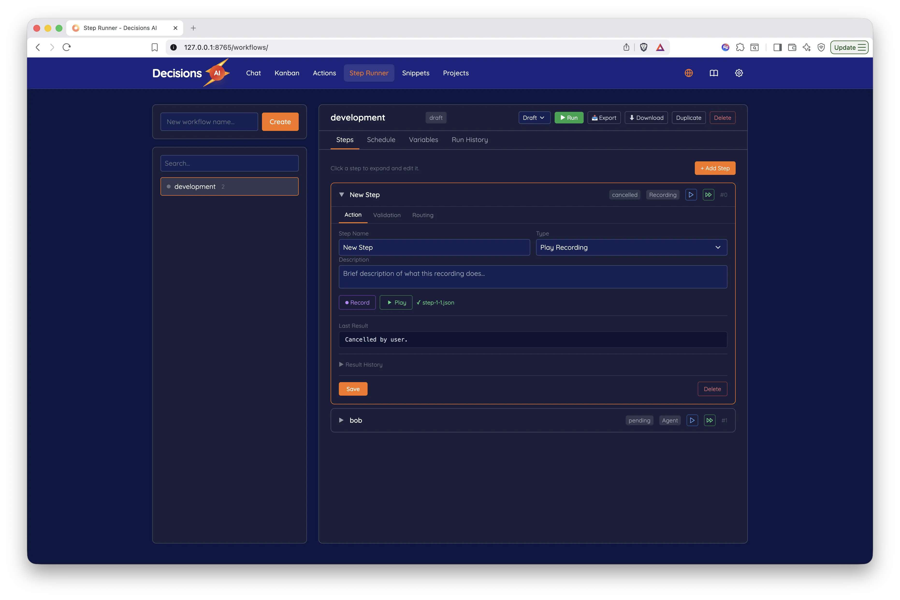

<p align="center">
  
</p>

<h1 align="center">DecisionsAI</h1>

<p align="center">
  <strong>The last agent you'll ever need.</strong>
</p>

<p align="center">
  Start with a voice agent. Let it grow into the agent that runs your work.
</p>

<p align="center">
  
  
  
  
  <a href="LICENSE.md"></a>
</p>

<p align="center">
  <a href="https://www.decisionsai.net/"><strong>Website</strong></a> ·
  <a href="#start-simple"><strong>Start here</strong></a> ·
  <a href="#installation"><strong>Install</strong></a> ·
  <a href="#use-your-voice-in-three-different-ways"><strong>Voice &amp; dictation</strong></a> ·
  <a href="#use-it-from-your-phone"><strong>Phone</strong></a> ·
  <a href="#workflows"><strong>Workflows</strong></a>
</p>

---

## Start simple

At its simplest, DecisionsAI gives you two voice hotkeys:

- Hold **Option + Command** *(the default macOS push-to-talk shortcut)* to speak to the agent, ask for something, and hear its reply.
- Hold **Control + Command** *(the default macOS dictation shortcut)* to turn your speech into text inside whichever app you are using.

> “Open Safari.”  
> “Reply to this message.”  
> “Take what I’m saying and clean it up.”  
> “Summarize what is on my screen.”

The agent can talk back, control your computer, run an action, or answer in Chat. Dictation simply writes what you say at the cursor. Both modes can run locally, so you do not need to begin with projects, workflows, or a collection of cloud accounts.

That is the first layer: **ask for something and the agent does it**.

## Use your voice in three different ways

Voice is not a single mode in DecisionsAI. You can use it according to what you are trying to do:

| What you want | How you use it | What happens |
|---|---|---|
| **Talk to the agent** | Hold **Option + Command** by default on macOS | DecisionsAI understands the request, performs work, and replies |
| **Write with your voice** | Hold **Control + Command** by default on macOS | Your speech is transcribed and inserted where you are typing |
| **Trigger something familiar** | Say a voice command or use a saved shortcut | DecisionsAI opens an app, runs an action, pastes a snippet, or starts a recorded macro |

The default macOS shortcuts are **Option + Command** for push-to-talk and **Control + Command** for dictation. Shortcuts are editable in **Preferences → Shortcut Keys**, so they can fit around the tools you already use.

You can begin here and never touch a workflow. Voice, dictation, shortcuts, snippets, Chat, and actions are useful on their own.

## Use it from your phone

Telegram gives you the quickest way to reach the same agent away from your desk. Send a text, voice note, screenshot, or document and receive the answer in the same conversation.

When you need more than messaging, send `remote` to the Telegram bot. DecisionsAI returns a secure link to its mobile web interface, where you can talk or type to the agent, use snippets, view the screen, click, scroll, and transfer files. It is an encrypted web remote for your own DecisionsAI instance—not a separate native mobile app or a second agent.

At this stage it can still be simple: ask a question, send something to your computer, or tell the agent to perform one action. The project and workflow layers become useful only when the request needs to be tracked or carried through several steps.

## Then give it a project

Link a real project folder and continue speaking naturally:

> “On my website, make the green order button black.”

DecisionsAI uses the active project to understand what “the green button” refers to. It can create a ticket so the change is trackable, send the work to your coding agent or CLI, check the result, record the time, and tell you what changed.

You do not need to name a model, write a technical prompt, or manually assemble a workflow for a small request.

```text
You ask  →  DecisionsAI does the work  →  You get the result
                         │
                         └─ A project ticket keeps the history
```

Projects give the agent a home for the work. Tickets give each request a visible record. Memory keeps useful facts, decisions, files, failures, and next actions available when you return—even if you change models later.

## Let it handle a larger job

Now ask for something bigger:

> “Rebuild the checkout flow, fix the mobile layout, test it, and report back when it is ready.”

This is where the orchestrator and workflows become useful. DecisionsAI can split the request into tickets, use the existing **Development** workflow, and move the work through six clear stages:

```text
Understand → Plan → Build → Review and test → Fix what failed → Report
```

The workflow is not the product you have to operate. It is the method DecisionsAI uses when a request is too large or risky for a single action. The Workflows screen is there when you want to inspect progress, see which worker is active, review evidence, or steer the run.

DecisionsAI reuses a suitable workflow before considering a new one. The Development workflow already covers project context, implementation, independent review, testing, correction, reporting, and memory. Specialist workflows are only useful when they add something genuinely different.

## Grow into it

The product becomes more capable as your work becomes more demanding:

| Your request | What DecisionsAI adds |
|---|---|
| “Open this app” | Voice control and computer actions |
| “Rewrite this paragraph” | Dictation, Chat, and the conversational model |
| “Change this project” | Project context, a ticket, a coding worker, and time history |
| “Build and test this feature” | Planning, implementation, independent validation, and correction |
| “Handle these requests while I’m away” | Telegram, approvals, background runs, and reports |
| “Use the best worker for every step” | Automatic routing across local models, APIs, and coding CLIs |

Start with one model if that is all you need. Later, you can give planning, coding, vision, Computer Use, and review to different workers. DecisionsAI keeps the project and memory stable while Codex, Cursor, Claude Code, Pi, Ollama, OpenRouter, or another configured provider does a particular part of the job.

As the work grows, Telegram grows with it. The same conversation that handled a quick voice note can receive progress, present approval buttons, accept a correction, steer a running workflow, and return the final report. The web interface becomes mission control rather than another inbox you must watch.

**Ollama runs models. DecisionsAI runs work.**

<p align="center">
  
</p>

## What you get

| | Capability | In plain English |
|---|---|---|
| 🎙️ | **Voice and dictation** | Talk to the agent or dictate into any app |
| 💬 | **Chat** | Ask questions, work with files, and follow activity |
| 🗂️ | **Projects and tickets** | Keep every piece of work attached to the right place |
| 🔁 | **Development workflow** | Plan, build, review, test, correct, and report larger jobs |
| 📱 | **Telegram control** | Send work and make decisions from your phone |
| 🧠 | **Portable memory** | Keep what was learned when you change models or CLIs |
| 🧰 | **Skills and tools** | Use the browser, Computer Use, code, files, connected apps, and project-specific instructions |
| 👀 | **Visible progress** | See the current step, worker, elapsed time, evidence, and result |
| 🔒 | **Local-first operation** | Keep speech, models, memory, and projects local when you choose |

Ready to try it? Jump to [Installation](#installation). You can start with the voice agent and add the rest later.

---

## The Local Web Interface

DecisionsAI spins up a **local-only** web UI (not exposed to the internet). Open it from the Oracle menu or the in-app tray.

| Section | What you do there |
|---|---|
| **Preferences** | Choose models and voices, add API keys, connect Google and Telegram, tune behavior |
| **Skins** | Browse and swap avatar skins in Preferences |
| **Chat** | Switch model and voice inside a thread, compact context, fork chats, and read system activity inline |
| **Actions** | View, edit, rename, and trigger recorded macros |
| **Snippets** | Manage text or code snippets with trigger words |
| **Projects** | Project workspace with context blocks, linked files, and IDE/coding backend setup |
| **Ticket Boards** | Manage local, Jira, and Trello work; link WhatsApp numbers to a board; send tickets straight into the orchestrator |
| **Automations** | Scheduled instruction workflows with Run Now, history, and a calendar for time-entry blocks linked to tickets |
| **Workflows** | Multi-step workflows with **Loops** presets, Step Runner execution, validation, harness steering, browser evidence, and scheduling |
| **IRC** | Built-in IRC chat page for shared rooms alongside Telegram and WhatsApp |
| **Skills** | Browse local and vendored skills, including [ECC-backed capabilities](plugins/ecc/README.md), without duplicate setup |

<p align="center">
  
</p>

---

## System Requirements

### Offline / local mode

| | |
|---|---|
| **OS** | macOS (Apple Silicon & Intel), Windows, Linux |
| **RAM** | 8 GB minimum; 12 GB recommended for ornith:9b |
| **Python** | 3.12 |
| **System deps** | PortAudio, FFmpeg |
| **Disk** | ~200 MB for cloud models; ~6 GB for full local models |

> DecisionsAI detects your system RAM at first launch and picks models that fit. Local models use your machine's memory. Cloud models (marked `:cloud`) run remotely and do not load their weights into local RAM.
>
> **Recommended local setup (12 GB+ RAM):**
>
> | Role | Model | RAM needed |
> |---|---|---|
> | Chat | `ornith:9b` | ~6 GB |
> | Coding | `ornith:9b` | ~6 GB |
> | Vision | `qwen3-vl:2b` | ~1.9 GB |
> | Image | `x/flux2-klein:latest` | local only |
>
> **Local-only fallbacks (10 GB+ RAM):**
>
> | RAM | Chat model | Coding model | Approx. VRAM |
> |---|---|---|---|
> | 10–11 GB | `qwen3:4b` | `qwen2.5-coder:3b` | ~3.5 GB |
> | 12+ GB | `ornith:9b` | `ornith:9b` | ~6 GB |

### Online / cloud mode

| | |
|---|---|
| **RAM** | 4 GB minimum, 8 GB recommended |
| **Disk** | ~200 MB |
| **Internet** | Stable connection required |

No large model downloads. Only Whisper.cpp and Kokoro install locally. Use local models for sensitive work and cloud models when you need bigger weights.

<p align="center">
  
</p>

---

## Installation

### One-liner

```bash
curl -fsSL https://decisionsai.net/install.sh | bash
```

### Quick start

```bash
git clone https://github.com/tensology/decisionsai.git
cd decisionsai
```

| Platform | Command |
|---|---|
| **macOS** | Double-click `decisions.app`, or `./bin/decisions.sh` |
| **Windows** | Double-click `bin/decisions.bat`, or `bin/decisions.ps1` |
| **Linux** | `./decisions` |

The launcher handles dependency checks, Python setup, model downloads, and launch automatically.

When [Codex](plugins/codex-ide/README.md), [Cursor](plugins/cursor-ide/README.md), or the [Claude-compatible harness surface](plugins/ecc/docs/HERMES-SETUP.md) are available on the machine, setup and every `bin/start.py` run recalibrate the **harness stack**: repair IDE plugins, re-project skills (so plugin reinstall does not wipe them), refresh MCP recommendations, and merge safe MCP servers into Cursor/Codex configs. Third-party keys such as Composio and Cursor API tokens are stored in **Preferences → API Keys** and injected at recalibrate time — you should not need to edit `~/.cursor/mcp.json` by hand.

### Manual installation

```bash
# 1. Python environment
python3 -m venv venv
source venv/bin/activate  # Windows: venv\Scripts\activate

# 2. Dependencies
pip install -r requirements.txt

# 3. Download AI models
python bin/setup.py

# 4. Start
python bin/start.py
```

**System deps:** `brew install portaudio ffmpeg` (macOS) · `sudo apt-get install portaudio19-dev ffmpeg` (Linux) · winget/Chocolatey/Scoop (Windows)

### Optional components

| Component | Install | Notes |
|---|---|---|
| **Vosk** (alt STT) | `python bin/setup_vosk.py` | ~1.8 GB English model |
| **Voice cloning** | Built-in for Kokoro and ElevenLabs | Click **+ Custom** next to voice dropdown in Preferences |

---

## Keyboard & Voice Commands

### Voice commands

Exact phrasing can vary.

| Category | Examples |
|---|---|
| **Navigation** | "Open Safari", "Focus on Slack", "New tab", "Close", "Open spotlight" |
| **Text editing** | "Copy", "Paste", "Undo", "Select all", "Delete line" |
| **Mouse** | "Mouse up", "Click", "Double click", "Scroll down", "Move mouse center" |
| **AI assistant** | "Dictate", "Transcribe", "Explain this", "Rework this", "Summarize this", "Translate" |
| **Macros** | "Start recording", "Stop recording", "Run action [name]" |
| **Media** | "Pause", "Next track", "Volume up", "Mute" |
| **System** | "Start listening", "Stop speaking", "Exit" |

### Global shortcuts

Defaults are editable in **Preferences → Shortcut Keys**.

| Shortcut | Action |
|---|---|
| Hold `Option + Command` | Push-to-talk |
| Hold `Control + Command` | Hold-to-dictate |
| `Cmd + Option + C` | Open Chat web UI |
| `Cmd + Option + J` | Open Projects web UI |
| `Cmd + Option + A` | Open Actions web UI |
| `Cmd + Option + N` | Open Snippets web UI |
| `Cmd + Option + W` | Open Workflows web UI |
| `Cmd + Option + ~` | Open Preferences web UI |
| `Control + Command + Left / Right` | Previous / next skin |
| `Cmd + Option + 1..9` | Select skin by index (`1` = Oracle) |
| `Control + Command + Up / Down` | Increase / decrease Oracle size |
| `Cmd + Option + S` | Toggle recording start/stop |

---

## Integrations

### Telegram

Connect in **Preferences → Advanced → Telegram**. Telegram is the fastest way to hand DecisionsAI work from anywhere: send text, a voice note, screenshot, document, correction, or follow-up. The same orchestrator can answer directly, create/update a project ticket, start a workflow, pause for a decision, or steer an existing run. Inline buttons and typed or spoken replies support approve, reject, continue, stop, and feedback. Progress and final reports return to the same conversation. Type `remote` for an HMAC-encrypted link to the full remote-control UI: screen stream, click, type, scroll, and file transfer.

### WhatsApp

Connect WhatsApp in **Preferences → Advanced**, then link a contact or group feed to a Ticket Board. DecisionsAI can sync incoming text, voice/media metadata, captions, and conversation context; configured boards can auto-snapshot new messages into durable tickets. From there the normal approval and orchestration policy can route the ticket to a project, direct action, or workflow. This deliberately keeps ordinary conversation from becoming unintended execution: only the feeds and autonomy boundaries you configure become work.

### Google Workspace

Connect via **Preferences → Advanced → Google** (OAuth 2.0).

| Service | Capabilities |
|---|---|
| **Gmail** | Read, send, draft, reply |
| **Calendar** | Create events, check schedule |
| **Drive** | List, read, upload |
| **Docs** | Create from Markdown |
| **Sheets** | Read and interact |

### IDE Integration

[Codex](plugins/codex-ide/README.md), [Cursor](plugins/cursor-ide/README.md), the [Claude-compatible harness surface](plugins/ecc/docs/HERMES-SETUP.md), and other coding backends attach to project context. Ticket-board work, IDE chats, workflow runs, and automation runs can report back to the orchestrator when the project link is set.

Setup installs or repairs the local [Codex](plugins/codex-ide/README.md) and [Cursor](plugins/cursor-ide/README.md) plugins when those tools are present. They emit session events into [Orchestrator](docs/orchestrator.md) so the desktop agent can see IDE progress instead of losing it inside the editor.

**Harness stack** (orchestrated from `distr/core/harness_stack.py`, run on `bin/setup.py` and quietly on every `bin/start.py`):

| Pack | What it adds |
|---|---|
| ECC | Vendored skills, agents, commands (`plugins/ecc`) |
| Competition | Ponytail + Fallow skills and Cursor ponytail rule — see [ponytail/fallow assessment](audit-docs/ponytail-fallow-reference-assessment.md) |
| Capabilities | Browser QA, Playwright, content-engine, fal-ai-media |
| Design references | Refero, Mobbin, Aceternity, Godly + UI ideation skills |
| Agent Reach | Public web/social research (Twitter, Reddit, YouTube, Exa, …) |
| Community skills | humanizer, last30days, curated marketing + design aesthetics |
| yt-dlp | YouTube metadata/subtitles + workflow `ytdlp` steps |
| Composio Connect | SaaS tool Router MCP (replaces deprecated Rube) |
| MCP harness | Catalog + add-only merge into Cursor/Codex; see `~/.decisions/harness/mcp-recommendations.json` |

Workflow runs can push a **pre_chain** of skills into the active project harness (browser, design, agent-reach, composio, yt-dlp, etc.) based on ticket text and project surface.

The Decisions agent exposes **`ide_thread`** to list, read, and prompt Codex/Cursor sessions. **Composio** API keys live under **Preferences → API Keys**; saving recalibrates MCP headers automatically.

[Orchestrator](docs/orchestrator.md) holds tickets, boards, automations, workflows, browser runs, project folders, and IDE sessions in one ledger. Local skills live under `skills/`; vendor packs under `plugins/*-pack/`.

### Models are roles, not a lock-in

Preferences separates the conversational/orchestrator LLM, coding LLM, vision model, image model, Computer Use model, Step Runner, and board agent. Each workflow step can override the backend, provider, model, tools, skills, cost tier, and independence requirement.

With opt-in **Auto** routing, DecisionsAI evaluates the step role, complexity, risk, capability requirements, and recorded failures. It can plan with Codex, implement bounded work with a free/local Ornith model, choose an independent reviewer such as HY3, and escalate to more expensive providers only when the lower tier has produced evidence that it is stuck. The chosen route and reason appear immediately in Runs/chat activity.

[Ornith 1.0](https://huggingface.co/deepreinforce-ai/Ornith-1.0-35B) is a particularly strong local fit: the open-source agentic-coding family includes 9B and 35B variants with tool calling. DecisionsAI supports `ornith:9b` for accessible local work and configured 35B variants for more capable machines, while keeping the project memory portable if you swap it out later.

---

## Workflows

Multi-step workflows run on the **Step Runner**. **Loops** are reusable development and operational playbooks on top of that runner. A group of project tickets can move through planning, implementation, independent review, tests, browser QA, approval, and reporting while each step uses a different model or CLI. Import a loop preset, steer a waiting harness from Telegram or the web UI, and inspect validation, routing history, executor context, evidence, heartbeats, and reports in the existing Runs/chat surfaces.

| Concept | How it works |
|---|---|
| **Actions** | Agent instructions, recorded macros, shell commands, HTTP requests, Playwright scripts, or **yt-dlp** (metadata/subtitles/search) |
| **Tool-calling agent** | Each step uses an LLM with native tool calling |
| **Validation** | Text matching, rule-based checks, LLM judgment, or screenshot comparison |
| **Static routing** | Pick a "go to" step for pass/fail |
| **Agent routing** | Prompt the agent; it picks the next step |
| **Recording** | 3-2-1 countdown, captures keyboard + mouse, replays automatically |
| **Presets** | Export/import `.dwf` bundles (workflow + recordings + screenshots) |
| **Scheduling** | Hourly, daily, or weekly on specific days |
| **Agent Context** | One context block for rules, credentials, and conventions prepended to step prompts |
| **Per-step workers** | Choose or auto-detect provider, model, CLI, capabilities, skills, tools, cost tier, and reviewer independence |
| **Neutral memory** | Save facts, decisions, evidence, files changed, blockers, and next actions without binding the project to one harness |
| **Remote interaction** | Approve, reject, continue, stop, or steer from Telegram; mirror meaningful progress and results back to the originating channel |

<p align="center">
  
</p>

---

## Technology Stack

You do not need to understand this stack to use DecisionsAI. These are the main components for people who want to extend or audit it.

**Offline core:**

| Component | Role |
|---|---|
| [Whisper.cpp](https://github.com/ggerganov/whisper.cpp) | Fast, accurate offline speech recognition |
| [Kokoro](https://github.com/thewh1teagle/kokoro-onnx) | High-quality offline TTS + custom voice cloning (on-device) |
| [Coqui TTS](https://github.com/coqui-ai/TTS) | Multi-speaker offline TTS (VCTK, 100+ speakers) |
| [Ollama](https://ollama.ai/) | Local LLM inference (Llama, Gemma, Qwen, and more) |
| [Pipecat](https://github.com/pipecat-ai/pipecat) | Real-time voice pipeline orchestration |
| **[Orchestrator](docs/orchestrator.md)** | Internal ledger for ticket routing, IDE sessions, browser evidence, validation, correction loops, and run memory |
| **[Sidecar (Go)](sidecar/README.md)** | Machine control: accessibility tree, mouse/keyboard, screenshots, drag, scroll, and Python execution |

**Optional cloud services:**

| Service | What it adds |
|---|---|
| [OpenRouter](https://openrouter.ai/) | One connection to a changing catalog of hosted models |
| [OpenAI](https://openai.com/) | OpenAI language, vision, and tool-capable models |
| [Anthropic](https://www.anthropic.com/) | Claude language and coding models |
| [ElevenLabs](https://elevenlabs.io/) | Cloud TTS with voice cloning |
| [AssemblyAI](https://www.assemblyai.com/) | Advanced transcription and speech recognition |

---

## Project Structure

```
bin/                 # Launchers and setup scripts
distr/
├── core/            # Agent pipeline, LLM, STT, TTS, actions, workflows
├── gui/
│   ├── dialogs/     # About, preferences windows
│   ├── oracle/      # Oracle overlay and tray
│   └── web/         # Local web UI (templates, static, API)
plugins/             # IDE plugins (codex-ide, cursor-ide), ECC, and vendor harness packs (competition, agent-reach, community-skills, yt-dlp)
skills/              # Local Decisions skills (harness stack, playwright, composio, design references, …)
sidecar/             # Go binary: machine control (macOS/Windows)
assets/
├── avatars/         # Skin packs (Clippy, Nugget, Rusty, Masko, etc.)
└── readme/          # README images
docs/                # Orchestrator docs (local planning notes stay gitignored)
.artifacts/          # Gitignored local runtime output (tickets, pi skills, cursor handoffs)
tests/               # Property-based and unit tests
```

---

## Legal References

| Document | URL | Policy check date |
|---|---|---|
| Privacy Policy | <https://www.decisionsai.net/privacy> | 2026-05-22 |
| Terms and Conditions | <https://www.decisionsai.net/terms> | 2026-05-22 |

Connected services can include WhatsApp, Telegram, Gmail, Jira, Trello, shared chat rooms, uploaded files, voice notes, images, project folders, CLI/IDE logs, model-provider requests, and workflow audit trails. Review the public policies before connecting external accounts or data sources.

---

## Contributing

Suggestions, bug reports, and pull requests are welcome. Open an issue to discuss a change before sending a PR. Check existing issues first to avoid overlap.

## License

Licensed under the TENSOLOGY COMMUNITY LICENSE AGREEMENT. See [LICENSE.md](LICENSE.md) for details.

---

> **Note:** This project has no cryptocurrency or token associated with it. Any coin using the DecisionsAI name is not affiliated with us.
