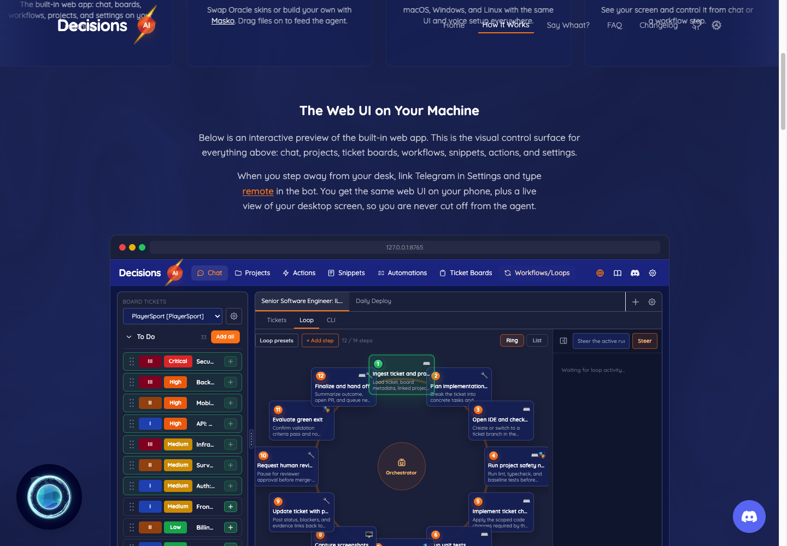
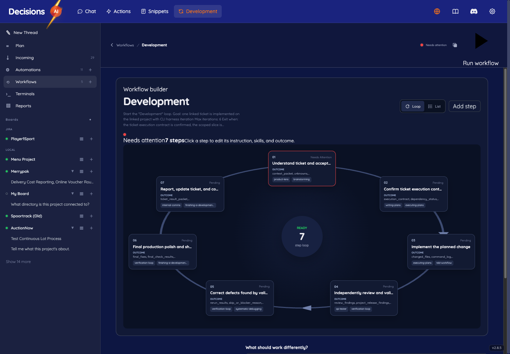

# DecisionsAI: Development audit and restructuring plan

5 September 2026. Audit of the current working tree and running local application.

## 1. Decision and scope

**The website preview is out of date, and Development needs stronger ownership and lifecycle boundaries before its files are reorganized.** This is more than a folder naming problem. The audit found lost edits, incorrect project selection, altered schedules, and a blocked instruction queue.

Twenty findings are recorded below. Eleven backend cases and three browser cases were reproduced in isolated fixtures. An additional browser check reproduced the loss of the whole Development catalog when one connector request fails. The application was not restarted, and no production content, schedules, workflows, or application source were changed.

**Recommended order:** protect plan content and execution correctness; isolate section state and failures; extract existing behavior into feature modules; then refresh the website from the real product. Preserve the existing Python/FastAPI/Jinja application and its working execution engine.

| Priority | Meaning | First work |
| --- | --- | --- |
| P1 | Wrong data, lost work, missed execution, or blocked work | Plan saves and scope; automation import and dispatch; instruction queue; shell failure isolation |
| P2 | Misleading state, inaccessible UI, maintenance friction | Workflow readiness, styling, mobile Plan, timer, website parity, behavioral tests |
| P3 | Incomplete product surface | Reports and later Plan-to-delivery capabilities |

The audit covers the public home and How It Works pages, their React preview, Development navigation, board/project ownership, board Plan, thread plans, workflows, automations, chat threads, and adjacent Incoming/Terminals/Reports integration points. It is not a complete security assessment, an exhaustive test of every integration, or a certification of all runtime behavior.

**Evidence baseline:** application HEAD `7a9c4866`, website HEAD `3e54bd1`; both repositories are on `main` with existing uncommitted work. The app reported v2.8.5 at `http://127.0.0.1:8765`. The browser loaded `studio.js?v=20260903-7` and `studio.css?v=20260903-30`. HEAD alone does not describe the audited code because much of Development is uncommitted.

Application root (A): `/Users/paul/development/TENSOLOGY/DECISIONS/DecisionsAI`.

Website root (W): `/Users/paul/development/TENSOLOGY/DECISIONS/www.decisionsai.net`.

## 2. The website and product no longer describe the same interface

**F01. P2. Confirmed live and in source.** The public preview puts Projects, Automations, Ticket Boards, and Workflows/Loops in the top navigation. The running product has Chat, Actions, Snippets, and Development, with Plan, Incoming, Automations, Workflows, Terminals, Reports, boards, and threads inside Development. The preview has no Development shell or board Plan workspace.

The mock workflow shows a ticket queue, 12 sample steps, and an orchestrator ring. The current editor shows a workflow library followed by a seven-step Development workflow. Shared colors and the Oracle logo provide some continuity, but navigation, grouping, editing, and task context differ materially.

<div class="comparison"><figure><figcaption>Public website: separate top-level tools and the older workflow layout.</figcaption></figure><figure><figcaption>Running app: Development sidebar and current workflow editor.</figcaption></figure></div>

The cause is structural: W `frontend/src/components/MockAppPreview.tsx` is a separate 4,267-line implementation, with five dedicated mock stylesheets. Its navigation comment still says it matches the real application's base template (lines 53-61). The `Automations` label even maps to an internal page called `Skills`.

**Recommendation:** replace this maintenance burden with sanitized screenshots or a constrained demo using the real application templates/styles and fixture responses. Start with screenshots, which are cheaper to keep accurate. Label sample data and simulations. Release website captures with an app version, route, and viewport manifest. Recheck the public claim that Telegram opens the “same web UI”: the project README describes a separate mobile remote surface. Keep marketing edits targeted and preserve production-managed copy if it differs from local source.

Sources: [live How It Works](https://www.decisionsai.net/how-it-works), W `frontend/src/components/MockAppPreview.tsx:14,53,2104`; A `distr/gui/web/templates/base.html`, `distr/gui/web/templates/workflows/studio.html:13`.

## 3. Where the coupling is concentrated

**F02. P2. Strong architectural recommendation.** The Development shell owns routing, selection, fetching, renderers, dialogs, event wiring, execution state, and feature-specific behavior in one closure. Splitting this into arbitrary numbered files would preserve the underlying coupling.

| Current file under A | Size / responsibility | Consequence |
| --- | --- | --- |
| `distr/gui/web/static/workflows/js/studio.js` | 7,408 lines; 444 named functions | A feature can overwrite another feature's state or lifecycle |
| `distr/gui/web/routes/settings/workflows.py` | 4,470 lines; 142 route handlers | Planning, threads, commands, artifacts and execution live under Settings/Workflows |
| `distr/gui/web/static/workflows/js/workflows.js` | 14,647 lines | A second workflow editor remains accessible in blueprint mode |
| `distr/gui/web/templates/workflows/workflows.html` | 4,449 lines including embedded styling/scripts | A substantial parallel presentation implementation |
| `distr/gui/web/static/workflows/css/studio.css` | 1,997 lines | Shared feature selectors can drift from generated markup |
| `distr/core/workflow/development_harness.py` | 1,404 lines | Project resolution, changes, execution and recovery share a module |

The current shape is:

```text
Development shell
  -> projects, boards, external boards, chats, workflows, runs
  -> inbox, automations, skills, model routing
  -> Plan through window.DecisionsPlanHost
  -> direct execution + workflow execution + command control + time

Settings/workflows route registration
  -> planning persistence, Development threads, workflow service
  -> artifacts, integrations, project operations, execution controls
```

**F03. P1. Failure isolation reproduced; stale-response risks found in source.** `refreshShell()` awaits ten requests together. Simulating a 503 for external boards caused the Workflows page to show zero workflows, zero automations, and “No ticket boards connected”, although the live catalog contained data. One optional connector can prevent the core local interface from loading.

The shell also refreshes every six seconds, retrieves current-thread detail even in other sections, and has no single-flight guard for `refreshShell()`. Unlike `loadChat()`, its writes do not consistently check a selection token. Late responses can therefore overwrite newer state; this particular cross-thread race was not reproduced end to end. Cached workflow detail is spread over fresh summaries, preserving stale fields. Isolate feature requests, retain last-known data with an error marker, and make selection-bound requests cancellable.

Sources: A `distr/gui/web/static/workflows/js/studio.js:4,1077,3969,4700,7389`; A `distr/gui/web/server.py:851` for the second editor.

## 4. Plan editing can lose work

**F04. P1. Reproduced in the real Plan JavaScript with a fake API.** Edit item A, return a 409 on save, then select B and return to A. The original text reappears. `saveItem()` catches the error without rejecting; `flushPendingSave()` therefore permits navigation. The unsaved editor buffer is discarded. Navigation must wait for an acknowledged save or preserve a recoverable draft when saving fails. The same rule must cover sidebar changes, browser history, reload, and language commands. Source: A `distr/gui/web/static/workflows/js/plan.js:175,190,214,221`.

**F05. P2. Reproduced with delayed fixture responses.** Opening a board Plan also starts an unawaited Plan-home load. If home finishes after board detail, home repaints over the workspace. A browser reproduction produced exactly that result. Give one route operation ownership of the view and ignore superseded responses. Sources: A `distr/gui/web/static/workflows/js/studio.js:1111,3267`; `plan.js:99,263`.

**F06. P1. Reproduced with two board workspaces.** An instruction addressed to workspace A can `replace with` or `rename to` an item belonging to workspace B. Only the append branch verifies workspace membership. This is an integrity boundary defect within the local app, not evidence of an unauthenticated exploit. Resolve and validate the item through its workspace before every operation. Source: A `distr/core/workflow/planning_workspace.py:234`.

**F07. P1. Reproduced with sequential stale-client writes.** Tab A saves new content; tab B saves its older draft; B silently replaces A. The file hash compares disk with the current database, not with the revision the client edited. Add an expected revision/hash to writes and return a conflict with both versions when it does not match. Sources: A `distr/core/workflow/planning_workspace.py:167`; `distr/gui/web/routes/settings/workflows.py:461,1722`.

**F08. P1. Reproduced.** Approve an item, then change its content. The changed item still reports `approved`. Approval is a mutable label rather than approval of a particular revision. A changed revision must be draft/review unless explicitly approved again, with the approved revision retained for traceability. Source: A `distr/core/workflow/planning_workspace.py:167`.

**Acceptance gate for these repairs:** multi-tab edits, save failures, delayed navigation, item ownership, and post-approval changes must pass through public service methods and real browser interactions. Source-string assertions cannot establish these behaviors.

## 5. Plan persistence and product promises need a clear boundary

**F09. P1. Reproduced by failing the database commit.** Plan writes the project file before committing the database and revision record. A commit failure leaves new content on disk and old content in the database. A retry then sees an external-file conflict. Use staged file writes and an explicit recoverable persistence operation; a file rename alone cannot make a filesystem and database transaction atomic. Record enough state to reconcile interruption without replacing user edits. Source: A `distr/core/workflow/planning_workspace.py:121,135,167`.

There is also a recovery gap: the conflict message says “Reload it before saving”, but `get_workspace()` returns database content and the UI exposes no file reconciliation action. A normal reload cannot import an external edit. Treat that as part of F09's repair, including deleted files, moved roots, and relinked projects.

**F10. P1. Reproduced.** Project discovery creates an overview, a user edits it in Plan, and a later scan replaces that content with the generated overview. A revision remains, but the active curated content is silently replaced and the UI has no history restoration control. Generate a candidate revision and show a merge/diff against the maintained item. Source: A `distr/core/workflow/planning_workspace.py:203`.

**F11. P2. Reproduced and confirmed in source.** “Create a PRD for offline invoices with QR payment” creates a generic template with none of that requested subject matter. Item editing recognizes only append/add/include, replace, and rename prefixes. Discovery reads top-level filenames and a README excerpt. There is no general language planning operation here. Either expose this honestly as template creation and literal commands, or implement scoped proposals, previews, and approved application of changes. Source: A `distr/core/workflow/planning_workspace.py:203,234`.

**F12. P2. Browser-reproduced at 390 pixels.** The Plan outline is hidden on mobile, removing all item-selection buttons. A workspace with two existing items opens the first, with no replacement selector or drawer for the second. Add an accessible item picker and keep selection in the URL. Source: A `distr/gui/web/static/workflows/css/studio.css:334`; `plan.js:141,162,263`.

**Product gap, separate from bugs:** board planning currently has workspace/item/revision records. The earlier product proposal's baselines, delivery slices, requirement relations, ticket previews, and evidence links are not implemented in this module. Thread plan revisions and reusable workflows are separate existing concepts. Keep that distinction: the board plan records intent, the ticket scopes work, the thread carries the conversation, and the run records execution.

## 6. Automation imports and scheduling can change the work

**F13. P1. Project-selection defect reproduced; scope symptom observed live.** Given a source working directory matching project A exactly and a registered nested project B, `_match_project_id()` chooses B because it selects the longest related path, including descendants. An import can therefore target an unrelated nested application. Prefer exact matches, then explicitly permitted containing projects; ambiguous or missing scope must remain unresolved.

Imported `cwds` are retained in configuration, but thread setup depends on the resolved project. With no linked project, the native harness creates a folder from the task title. A live imported automation transcript showed an empty generated project, unsuccessful attempts to find the intended work, and a later completed turn that merely wrote a README explaining blockers. That demonstrates a real scope/outcome mismatch; it does not prove every imported automation is misbound. Inspect current import-to-project mappings before rerouting any existing automation.

Sources: A `distr/core/automation/imports.py:171,201`; `distr/core/automation_orchestrator.py:281`; `distr/core/workflow/development_harness.py:465,474`.

**F14. P1. Reproduced.** `FREQ=WEEKLY;INTERVAL=2;BYDAY=MO;BYHOUR=9;COUNT=3` becomes an ordinary weekly schedule without the two-week interval or run limit. Unsupported RRULE fields are silently dropped. The cron conversion also ignores day-of-month and month for fixed hour/minute expressions. Preserve supported semantics exactly and reject unsupported rules with an import preview. Test timezone, DST, finite schedules, multiple times, and monthly boundaries. Source: A `distr/core/automation/imports.py:96,128`.

**F15. P1. Reproduced with a one-time schedule and failed dispatch result.** The scheduler disables the one-time schedule and clears its next run before dispatch. If dispatch returns `{status: failed}` because thread preparation failed, the scheduler still returns success. This can consume the only scheduled opportunity without a recorded successful start. Create a durable execution attempt and inspect the dispatch result before acknowledging delivery. Retry according to an explicit idempotency/misfire policy. Sources: A `distr/core/automation/scheduler.py:114`; `scheduler_advance.py:17`; `automation_orchestrator.py:770`.

The previous September 2 audit's orphan-run recovery and import route configuration changes exist in current source. They should not be reopened as missing features. The new findings concern scope, schedule fidelity, and dispatch acknowledgement.

## 7. Thread control and time need execution-owned transitions

**F16. P1. Reproduced.** Queue two instructions before a worker is available. `dispatch_pending()` selects the first record from a query containing both queued and delivered commands. After the first is delivered, the next dispatch selects it again; `dispatch_command()` reports it already delivered, and the second stays queued. The reproduction called dispatch twice and observed one worker delivery and statuses `[delivered, queued]`.

Select only queued commands for dispatch. Keep delivered records in history, but remove them from the pending selection. Add an atomic claim and a delivery idempotency key so concurrent requests cannot deliver the same instruction twice. The starvation is reproduced; duplicate delivery under concurrency is a separate source-level risk needing a concurrency test.

Sources: A `distr/core/workflow/development_control.py:62,128,182`.

**F17. P2. Reproduced.** An idle thread with a running timer and no response continues accumulating time indefinitely. The auto-pause rule requires a sufficiently recent child response; no response means no pause. An isolated three-day idle thread returned `running: true` and 72 hours. The live automation thread also displayed about 72 hours, but its exact historical accounting was not reconstructed.

Execution terminal events, failures before response, cancellation, and restart recovery should close active work intervals. If manual user time is also supported, distinguish it from agent execution time. Reading a time endpoint currently updates ticket time; moving this accounting into lifecycle operations will make it testable without browser polling.

Sources: A `distr/core/workflow/development_control.py:248,275,309`; `distr/core/workflow/work_dispatch.py:248`.

**Existing foundations worth retaining:** `DevelopmentWorkItem` has unique chat and identity constraints; `ensure_development_thread()` gives durable source identity; thread plan revisions exist; `work_dispatch()` prepares the visible thread before starting a workflow; ownership-aware deletion and startup recovery already have focused tests. Improve those seams rather than replacing them with a new generalized orchestration framework.

**Remaining lifecycle investigations:** simultaneous creation for one identity, archive/delete during an active run, workflow-backed command steering, changing a board/project while a run is active, stop acknowledgement across native and CLI execution, and completion evidence returning to the correct ticket. These are required follow-up test cases, not confirmed defects in this audit.

## 8. Workflow state and styling have visible contradictions

**F18. P2. Confirmed live and in source.** The live library labels the empty Ideation workflow “0 steps · Ready” and offers Start. The editor's header can show “Needs attention” while the ring center says “Ready”. Readiness is derived from lack of an active run rather than definition validity. Separate definition validity, current execution, last outcome, and unmet input/approval states. Disable Run for invalid definitions with a concrete reason.

Sources: A `distr/gui/web/static/workflows/js/studio.js:1875,1893,2063,2093`.

**F19. P2. Confirmed by screenshot, computed style, and source.** The current editor generates `.workflow-run-button` and `.workflow-canvas-meta`, but the Development stylesheet has no matching component styles. At 1440 pixels, the Run SVG measured approximately 101 by 101 pixels and its button about 101 by 125 pixels. The metadata appeared as joined “Needs attention7 stepsClick...” text. The oversized Run icon also appeared at 390 pixels. This is a concrete markup/style contract regression.

Keep a feature's markup and styles together, define icon dimensions, and test the rendered editor at desktop and compact widths. A screenshot from the earlier successful design change is not evidence for the current working tree.

Sources: A `distr/gui/web/static/workflows/js/studio.js:2093`; `distr/gui/web/static/workflows/css/studio.css:1139,1164`; `live-workflow-editor.png`.

**F20. P2. Reproduced test failure.** Of 133 selected existing tests, 132 passed and one failed. The failure expects `studio.js?v=20260903-2`, while the template loads `20260903-7`. That test should assert a behavior or a stable asset-loading contract. Several other tests inspect source strings; the mobile Plan test explicitly checks that the outline is hidden but does not test access to the second item. Passing these tests therefore does not establish usable navigation or safe saves.

Source: A `tests/core/test_board_project_unification.py:36`; `tests/ui/test_plan_workspace_playwright.py:61`.

**Other product inconsistencies:** Reports is currently a static “No reports yet” placeholder with no report loading in this shell. “Plan” also names board documents, thread execution plans, and an autonomy mode. “Automations” opens a page titled “Scheduled tasks”, while a separate automation-rules route covers another type. Resolve terminology in navigation and help text before creating more shared components.

## 9. Proposed ownership and file organization

This is a restructuring proposal, not a finalized new interface design. Preserve the current data identities and external API compatibility while moving responsibilities behind clearer boundaries.

```text
distr/core/
  development/       # work-item identity, thread control, dispatch, run projection, time
  planning/          # board items, revisions, approval, discovery, file reconciliation
  automation/        # definitions, import, scheduling, attempts, retry policy
  workflow/          # reusable definitions, validation, step orchestration
  kanban/            # board/ticket persistence and provider adapters
  turn_runtime/      # native execution primitives, cancellation and steering

distr/gui/web/routes/
  development/       # threads, commands, executions, artifacts, context
  planning.py        # board workspaces and item operations
  automations.py     # retain current feature router
  workflows.py       # reusable workflow endpoints

distr/gui/web/static/development/
  shell/             # router, sidebar, catalog, selection, feature lifecycle
  threads/           # composer, transcript, activity, inspector, command queue
  planning/          # item picker, editor, preview, save controller
  workflows/         # library, editor, step dialog, run status
  automations/       # library, editor, import preview, schedule, run history
  boards/            # board picker and kanban integration
  incoming/          # intake views and channel state
  terminals/         # terminal view lifecycle
  shared/            # only proven shared UI: dialog, menu, status, API errors
```

All paths above are proposed beneath application root A. Move templates and styles alongside each feature's ownership; do not introduce a new build framework just to obtain directories.

| Boundary | Owns | Must not own |
| --- | --- | --- |
| Shell | URL, selected identities, layout, catalog availability | Plan draft text, workflow editing, automation dispatch |
| Planning | Source revisions and revision-specific approval | Starting an execution as a side effect of editing |
| Development | Durable thread/work-item identity, commands and run projection | Recurrence parsing or board document rendering |
| Automation | When and why an attempt runs, source schedule fidelity | Inferring project identity from task-title folders |
| Workflow | Validated reusable process and its run | Being the storage container for every Development feature |

Keep native and workflow execution adapters behind a small shared run projection: owner thread, execution kind, status, timing, result, and stop capability. Let each execution engine retain its internals. Preserve the established board orchestration policy and thread ownership model.

Avoid blanket renaming, a new event bus, generic repository wrappers for every table, or a wholesale React migration. Extract where it removes a demonstrated responsibility conflict or creates a useful behavioral test seam.

## 10. Sequenced remediation plan

**Phase 0. Establish the baseline and contract.** Record the current modified/untracked files and their owners without resetting anything. Agree the vocabulary: board, project, planning item, approved revision, ticket, thread, workflow definition, automation, execution attempt. Capture sanitized desktop/mobile fixtures. Owner role: development lead. Exit: reproducible evidence and stable scope for subsequent changes.

**Phase 1. Protect content and execution.** Fix F04 and F06-F10 in the current modules: save acknowledgement, expected revision, scoped item lookup, approval invalidation, recoverable file persistence, and discovery proposals. Fix F13-F16: exact project resolution, explicit unsupported schedule handling, durable dispatch acknowledgement, and pending-command selection. Owner role: backend/application developer. Exit: every corresponding reproduction becomes a regression test of the desired behavior; no data replacement or duplicate execution in failure cases.

**Phase 2. Give each UI section its own lifecycle.** First extract Plan's save/navigation controller, then the shell catalog and route selection. Fix F03, F05, F12, F18, and F19. Add a feature lifecycle that cancels requests, flushes or retains drafts, and releases timers/sockets on exit. Fetch only the visible section plus the small sidebar summary. Owner role: frontend developer. Exit: changing sections during slow/error responses cannot lose text, overwrite a newer selection, or blank healthy local features.

**Phase 3. Extract backend responsibilities in small moves.** Move planning services first, then Development commands/time/run projection, then split the Settings/workflows route registrar. Retain compatibility imports and existing route aliases during each move. Keep automation scheduling independent and call Development through one dispatch boundary. Owner role: backend developer. Exit: each feature's tests import its public service without web/server or unrelated integration initialization.

**Phase 4. Resolve duplicate editors and missing product flows.** Inventory users and behavior of `/workflows/?mode=blueprint`; retire it only after its unique operations are accounted for. Integrate Plan approval with ticket-preview and execution context as a separately scoped product increment. Add Reports only when there is a real report source and action. Owner role: product/development lead. Exit: one maintained workflow editor and a demonstrated approved-plan-to-ticket-to-thread path.

**Phase 5. Restore website parity and release discipline.** Capture the approved application routes with synthetic content and publish those captures or a fixture-backed demo. Update the navigation description and remote UI claims. Owner role: website developer. Exit: marketing and application review the same release manifest and interaction map.

**Suggested first implementation slice:** failed-save retention, workspace ownership checks, queued-command starvation, and the missing workflow styles. These are bounded and high-confidence. Follow with revision concurrency and automation schedule/scope repairs. Timing estimates should follow that first slice because the extensive uncommitted changes and live integration boundaries make a reliable calendar estimate premature.

## 11. Verification, acceptance matrix, and limits

**Executed evidence:** 49 selected existing tests passed in the first group. A broader group returned 83 passed and one failed. Total: **132 passed, one failed**, across 19 selected test files. The failure is the stale asset-version assertion described in F20. This was not a full test-suite run.

`reproduce_backend.py` reproduces eleven current defects using temporary SQLite databases, temporary project files, and mocked dispatch/worker calls. `reproduce_ui.py` runs the real Plan script with an in-memory API and reproduces three defects. They assert the observed broken behavior as audit evidence; convert them to desired-behavior regression tests during repair. They are not production tests to keep passing after a fix.

The fifteenth reproduction used a new browser context with external-board GET responses replaced by 503 and all mutations intercepted. It rendered zero workflow cards despite five being available in the ordinary live view. Website navigation, workflow library/detail, Plan home, automations, a thread, and Reports were inspected live. Desktop and mobile workflow screenshots and a mobile Plan fixture were visually inspected.

| Area | Required regression cases before restructuring is accepted |
| --- | --- |
| Plan edits | Failed save and navigation; two tabs; approve then edit; cross-workspace IDs; empty content; slow response ordering |
| Plan files | External edit; commit failure; process interruption; missing file; moved project; rediscovery after manual editing |
| Plan mobile | Select second and later items; route restoration; preview/edit/history; keyboard and focus behavior |
| Automations | Exact/nested/missing/multiple cwd; unsupported recurrence; DST; finite run count; one-shot dispatch failure; manual/scheduled collision |
| Threads | Two queued instructions; retry/idempotency; completion/failure with no response; restart; archive/delete while active |
| Workflows | Zero steps; invalid step config; waiting vs failed vs ready; cancel; stale cached detail; legacy-editor parity |
| Shell | One connector down; delayed requests during route changes; browser Back/Forward; deleted/archived deep links; long catalogs |
| Website | Navigation names; desktop and mobile screenshots; current editor; sample data; remote UI description |

**Not performed:** real automated publishing, message sending, production imports, destructive workflow runs, deleting active records, injected failures in the live database, end-to-end multi-agent/CLI cancellation, or a complete external-service/security audit. Those should use isolated fixtures and explicitly scoped integration environments.

**Artifact review:** the HTML rendering contains these same eleven sections. Its final rendered views must be inspected for clipping, overflow, overlaps, broken breaks, orphaned headings, table splitting/repetition, owner/action separation, missing headers/footers, readable type, and consistent branding before delivery. Source links use roots A and W defined on page 1, with verified line anchors recorded in the findings.
