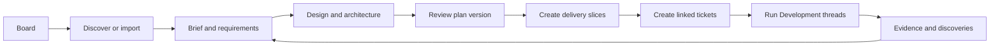
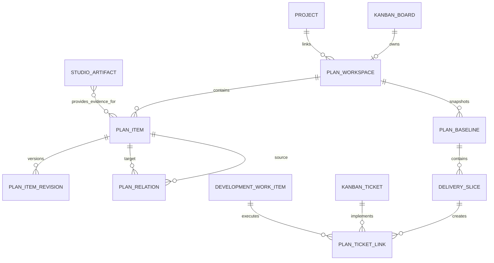

# Decisions AI Plan Workspace

Status: Product and implementation proposal

## Product decision

Plan should become the place where a board is understood before Development executes it.

The simplest durable model is:

1. A board is the planning container.
2. A planning item is anything the team creates or references: a PRD, functional requirements and acceptance criteria (FRAC), wireframe, ERD, brand asset, decision, research note, imported Word file, or delivery slice.
3. A plan version is an approved snapshot of selected planning items.
4. A ticket is an executable slice derived from an approved plan.
5. A Development thread executes one ticket and writes evidence and discoveries back to the plan.

Do not create a second kind of "project" inside Plan. The existing board remains the unit visible in the Development sidebar. A board may be linked to one project folder. The Plan landing page mirrors the Terminals landing page by showing one card per board or linked project.

## The end-to-end loop



Planning and execution stay separate, but they remain connected. Planning produces the source material and acceptance contract. Development consumes that contract and returns implementation evidence. A plan does not become a workflow. A workflow is the reusable process used to create, review, or execute plan content.

## Information architecture

### 1. Plan home

The global Plan entry opens a grid like Terminals. Each card represents a board and shows:

- board name and linked project folder;
- planning readiness, such as 62 percent or "Needs review";
- counts for documents, diagrams, assets, and delivery slices;
- the most recently edited item;
- primary action: Open plan;
- secondary menu: Generate from project, import files, set folder, archive.

The header contains a natural-language creation field. Examples:

- "Create a launch plan for this board"
- "Generate a plan from the existing DecisionsAI project"
- "Import these Word documents and organize them"

### 2. Board plan workspace

Opening a board uses one workspace with three stable areas:

- Outline: the board's planning items, grouped into Overview, Requirements, Experience, Architecture, Brand and assets, Delivery, and Decisions.
- Canvas: the active item or the board overview. This is the correct renderer for the item type: rich text, Mermaid, SVG, image, file preview, mind map, table, or ticket map.
- Context inspector: status, linked requirements, sources, revisions, dependencies, comments, and approval controls.

A language composer stays at the bottom. Its scope is visible as chips, for example `Decisions delivery / ERD / selected entities`. The same composer can create, edit, reorganize, compare, link, and approve content.

### 3. Board overview

The board overview is not a dashboard full of widgets. It answers four questions:

- What are we building?
- What is decided?
- What is missing or contradictory?
- What is ready to execute?

It contains:

- outcome and current plan status;
- a compact readiness checklist;
- recent planning items;
- unresolved questions and decision requests;
- delivery slices with dependency and ticket status;
- one clear action: Review plan or Continue planning.

### 4. Planning item types

All items share title, type, status, owner, source, tags, revisions, relationships, and approval state. Type controls the editor and renderer.

| Family | Types | Canonical source | Renderer |
| --- | --- | --- | --- |
| Requirements | Brief, PRD, FRAC, user stories, acceptance criteria | Markdown plus structured requirement IDs | Rich document and traceability table |
| Experience | Sitemap, user flow, wireframe, screen specification | SVG, HTML, Mermaid, Markdown | Visual canvas and responsive preview |
| Architecture | System diagram, event flow, ERD, API contract | Mermaid, DBML, OpenAPI, Markdown | Diagram, schema explorer, diff |
| Brand | Brand guide, tokens, logos, images, references | JSON, CSS, SVG, image files | Asset gallery and token preview |
| Delivery | Milestone, delivery slice, ticket set, test plan | Structured JSON plus Markdown export | Dependency map, list, ticket preview |
| Knowledge | Research, decision record, imported document, link | Markdown or original file with extracted text | Document viewer with sources |

"Artifact" remains a useful technical word, but the user-facing UI should say Items or Files unless the context specifically means generated execution output.

## Language interaction

Language is the primary manipulation layer, not a chatbot bolted beside the files.

Every command has an explicit scope:

- Board scope: "Find gaps across this plan."
- Section scope: "Organize these into Experience and Architecture."
- Item scope: "Add password reset to the PRD and update the affected wireframes."
- Selection scope: "Turn these three requirements into a delivery slice."

Before a broad change, show a change set with affected items and a short diff. Small edits can apply immediately and remain undoable through item revisions. Examples:

- "Create a FRAC from the PRD."
- "Show the ERD and add an audit event table."
- "Make the mobile wireframe use a bottom navigation."
- "What contradicts the approved brand guide?"
- "Create tickets for milestone one, but do not start Development."
- "Run the approved tickets in dependency order with the Development workflow."

The assistant should always cite the items and requirement IDs it used. Generated facts are marked as inferred until the user accepts them.

## Requirements and traceability

FRAC content should be structured even when displayed as a readable document:

```text
FR-014: A user can restore access through a verified email address.
AC-014.1: Given an active account, when a reset is requested, then a single-use link is sent.
AC-014.2: The link expires after the configured interval.
```

Stable IDs make the rest of the system useful. Wireframes, ERD entities, decisions, delivery slices, tickets, test cases, and execution evidence can all link back to FR and AC IDs. The Plan UI can then show coverage without inventing another project-management hierarchy.

## From plan to tickets

Tickets are created from delivery slices, not automatically from every document heading.

A delivery slice contains:

- outcome and user-visible behavior;
- linked FR and AC IDs;
- affected screens, data entities, APIs, and brand assets;
- dependencies and sequencing;
- implementation constraints;
- verification steps and evidence required;
- estimated size and suggested workflow.

The ticket receives references to the approved plan version and source items. It does not receive disconnected copies. Creating tickets is a reviewable preview operation. The user selects destination lane, workflow, grouping, and whether Development should start.

Once execution begins, each ticket thread loads a compact context pack containing only its linked slice, requirements, designs, architecture, decisions, and project instructions. On completion it writes back code references, test results, screenshots, deviations, and newly discovered decisions.

## Existing project generation

"Generate from project" should be a first-class action. It creates a draft plan without overwriting existing content.

The discovery run should:

1. Read project instructions, README files, manifests, routes, models, migrations, API definitions, tests, design tokens, and existing documents.
2. Run the application when safe and capture desktop and mobile screenshots of reachable routes.
3. Infer a current-state sitemap, user flows, component map, ERD, external integrations, deployment shape, and observed functional behavior.
4. Generate current-state wireframes from screenshots, clearly labelled as inferred.
5. Produce a draft PRD and FRAC with source links, confidence, and unresolved questions.
6. Compare generated content with any existing planning files and ask before replacing anything.

Generated content must distinguish observed, inferred, and proposed statements. The initial result should be useful even if the scan is interrupted. Each completed item is saved independently.

## File layout in the linked project

The database is the index and collaboration layer. The project folder remains the portable source of truth.

```text
planning/
  README.md
  brief.md
  prd.md
  functional-requirements.md
  decisions/
  experience/
    sitemap.mmd
    user-flows.mmd
    wireframes/
  architecture/
    system.mmd
    erd.mmd
    api/
  brand/
    tokens.json
    assets/
  delivery/
    milestones.md
    slices/
  verification/
    test-plan.md
.decisions/
  plan-manifest.json
```

Markdown, Mermaid, SVG, JSON, DBML, and OpenAPI remain editable and diffable. Word and PDF are supported as imported or exported representations. For a binary document, keep the original file and an extracted Markdown companion so language tools can search and update the content safely.

The manifest stores stable item IDs, type, status, relations, render settings, and approval metadata. It must never contain secrets.

## Data model

The current `DevelopmentPlanRevision` and `StudioArtifact` models are task-scoped. Keep them for execution plans and run outputs. Add board-scoped planning models so planning can exist before any Development thread.



Suggested records:

- `PlanWorkspace`: board identity, linked project, root folder, lifecycle state, current baseline.
- `PlanItem`: parent, family, type, title, path or URI, format, status, ordering, metadata.
- `PlanItemRevision`: immutable content or content hash, author, source, rationale, timestamp.
- `PlanRelation`: typed edges such as supports, satisfies, derived-from, depends-on, conflicts-with, implemented-by, verified-by.
- `PlanBaseline`: approved selection of item revisions and a generated change summary.
- `DeliverySlice`: executable outcome with linked requirements and dependencies.
- `PlanTicketLink`: destination ticket and Development work-item identity.

Avoid storing the same large content in both the database and the file tree. Store inline content for unsaved drafts, then persist path, revision hash, extracted searchable text, and metadata when an item is file-backed.

## API shape

```text
GET    /workflows/studio/plans
POST   /workflows/studio/plans
GET    /workflows/studio/plans/{workspace_id}
PATCH  /workflows/studio/plans/{workspace_id}

GET    /workflows/studio/plans/{workspace_id}/items
POST   /workflows/studio/plans/{workspace_id}/items
GET    /workflows/studio/plan-items/{item_id}
PATCH  /workflows/studio/plan-items/{item_id}
POST   /workflows/studio/plan-items/{item_id}/revisions
POST   /workflows/studio/plan-items/{item_id}/render

POST   /workflows/studio/plans/{workspace_id}/chat
POST   /workflows/studio/plans/{workspace_id}/discover
GET    /workflows/studio/plans/{workspace_id}/discover/{run_id}
POST   /workflows/studio/plans/{workspace_id}/baseline
POST   /workflows/studio/plans/{workspace_id}/ticket-preview
POST   /workflows/studio/plans/{workspace_id}/tickets
```

Language operations should return a proposed change set with item IDs, operations, and previews. Applying the change set creates item revisions atomically.

## UI behavior details

- Opening Plan clears the task header and composer state, just as Terminals has a home mode.
- The sidebar Plan row stays selected on Plan home and board Plan routes.
- Board context menus gain `Plan`, next to Kanban and Terminals.
- A board route becomes `/development/boards/{key}/plan/`.
- The global route remains `/development/plan/`.
- Deep links use `/development/boards/{key}/plan/items/{item_id}/`.
- The plan outline supports drag ordering, folders, filters, search, and keyboard navigation.
- Diagrams render safely with Mermaid security settings. SVG is sanitized before inline display.
- The item canvas has Edit, Preview, Compare, History, and Export modes.
- Mobile uses a single canvas. Outline and context inspector open as drawers. The language composer remains fixed.
- Every generated item shows source and confidence. Every approved item shows the approving plan version.
- Approval is available at item level and as a baseline review. Broad approval always shows the diff.

## Delivery phases

### Phase 1: Plan home and board workspace

- Replace the placeholder with board cards matching Terminals.
- Add board Plan routes and board context-menu action.
- Add PlanWorkspace, PlanItem, revision, and relation persistence.
- Build overview, outline, Markdown editor, file import, and scoped language composer.
- Reuse the existing project and board catalogs.

Exit condition: a user can open a board, create and organize PRD and FRAC items through language, edit them manually, and reopen the same state.

### Phase 2: Visual planning

- Mermaid rendering and editing for flows and architecture.
- ERD view with entity inspection and source editing.
- SVG and HTML wireframe canvas with desktop, tablet, and mobile frames.
- Image and brand asset gallery.
- Version compare, approval, and safe export.

Exit condition: a user can create, view, revise, and approve wireframes, ERDs, and brand material without leaving the board.

### Phase 3: Existing-project discovery

- Repository scanner and resumable discovery run.
- Route and screenshot capture through the existing browser tooling.
- Current-state docs, ERD, system map, screen inventory, and inferred FRAC.
- Provenance, confidence, conflict detection, and merge preview.

Exit condition: an existing project can produce a useful draft plan with traceable sources and no overwritten user content.

### Phase 4: Plan to delivery

- Baselines and readiness review.
- Delivery slices, dependencies, requirement coverage, and ticket preview.
- Local and external board ticket creation.
- Context-pack assembly for Development threads.
- Execution evidence linked back to requirements and plan items.

Exit condition: an approved milestone can become linked tickets and run in Development while retaining end-to-end traceability.

### Phase 5: Collaboration and hardening

- Comments, presence, ownership, notifications, and conflict handling.
- Word and PDF import/export, OpenAPI and DBML support.
- Accessibility, large-board performance, permission boundaries, and audit history.
- Recovery tests for file moves, deleted project folders, failed discovery, and interrupted ticket creation.

## What to reuse and what to change

Reuse:

- the Development shell, sidebar board catalog, project links, route restoration, dark visual language, cards, dialogs, and responsive drawer patterns;
- the existing scoped Development agent runtime and project tools;
- `DevelopmentPlanRevision` for executable thread plans;
- `StudioArtifact` for generated run outputs and implementation evidence;
- board-to-ticket-to-thread identity in `DevelopmentWorkItem`;
- Workflows as reusable creation, review, discovery, and delivery processes.

Change:

- replace `#plan-workspace` placeholder with Plan home and board Plan views;
- introduce board-scoped planning persistence rather than attaching the canonical plan to a chat;
- elevate artifacts from an inspector-only view into the board canvas;
- add explicit relations and stable requirement IDs;
- add baseline and delivery-slice concepts before ticket creation.

## Guardrails

- Never silently overwrite project files or production-edited content.
- A project discovery run creates drafts and merge proposals.
- Keep planning and Development task chats separate in the data model and UI.
- Do not make a ticket the source of truth for requirements or design.
- Do not execute merely because tickets were generated. Creation and execution are separate confirmations.
- Do not build a generic infinite canvas first. Purpose-built document and diagram renderers cover the valuable workflows with much less interaction complexity.
- Do not make Word the canonical internal format. Import and export it, but keep editable sources diffable.
- Do not hide relationships in prose. Requirements, designs, slices, tickets, and evidence need durable links.

## First implementation slice

The first slice should prove the full product shape with a narrow set of item types:

1. Plan home with board cards.
2. Board overview and outline.
3. Markdown items: Brief, PRD, FRAC, Decision.
4. Mermaid items: user flow and ERD.
5. SVG/HTML wireframe preview.
6. Scoped language changes with preview and revision history.
7. Baseline review.
8. Delivery-slice preview that creates local tickets but does not start them.

This is enough to validate the board model, language interaction, file layout, rendering, traceability, and Plan-to-ticket boundary before adding collaboration or more file formats.

