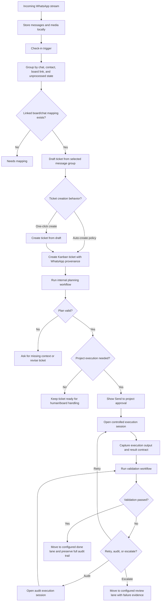
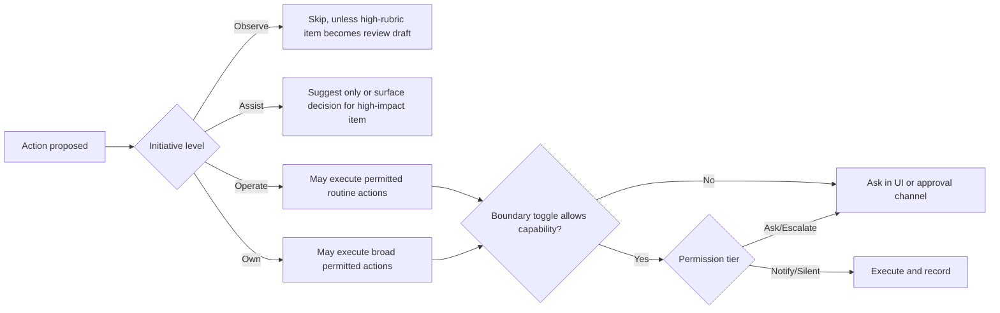

# WhatsApp Work Intake, Ticketing, and Completion PRD

Date: 2026-05-18  
Status: Draft for assessment and scoping  
Primary workflow assessed as an example instance: `auto_workflows.id=136`  
Related execution workflow assessed: `Ticket Execution Workflow` (`auto_workflows.id=121`)

## 1. Executive Summary

DecisionsAI already has most of the raw ingredients for WhatsApp-driven work intake:

- WhatsApp messages are stored locally in `whatsapp_messages`.
- Boards can be linked to WhatsApp contacts/chats through `whatsapp_phone_links`.
- WhatsApp messages can be composed into ticket drafts and snapshot tickets.
- Kanban tickets can be linked to projects, workflows, and controlled project execution sessions.
- Initiative can scan WhatsApp, boards, and Telegram, then suggest or queue actions based on user permissions.
- Project execution backends exist, including Pi, Codex, Cursor CLI, Claude Code, Cursor IDE, and VS Code IDE, but they should run inside Decisions-controlled execution sessions rather than disappearing into the background.

The current problem is orchestration. The assessed workflow is not really a reusable workflow yet. It is one large instruction that mixes intake, project setup, database loading, ticket creation, IDE launching, and execution, followed by an empty validation step. That makes it hard to reason about, hard to validate, and easy for the agent to do incomplete or irrelevant work.

This PRD is not project-specific. The assessed workflow and board are evidence for the product problem, not hard-coded requirements. The product should work for any linked board, WhatsApp chat, project, workflow, and configured execution route.

The recommended product direction is to split WhatsApp work into a first-class intake pipeline:

1. Collect inbound WhatsApp messages at a check-in point.
2. Group messages by chat/contact and linked board.
3. Convert only confirmed or policy-approved work into structured tickets.
4. Attach media and source provenance.
5. Route tickets through a plan-first workflow.
6. Open a controlled project execution session when needed: project workflow, CLI/IDE backend, audit/review worker, human review, or customer reply drafting.
7. Show a complete audit trail in the web UI: source message, ticket, plan, execution session, validation loop, customer reply draft, and final status.

Product north star:

- Good version: WhatsApp comes in, one click creates a clean ticket, one clear approval sends it to the project, and the audit trail fills itself in quietly.
- Bad version: every step asks for permission, every message becomes admin, and the user spends more time managing the system than doing the work.

The system should keep structure under the hood while making the visible user flow feel almost stupidly simple.

Workflows should be backstage infrastructure, not the main user experience. The value is reliable ticket to execution to validation, not making users design process diagrams. Normal users manage work and outcomes from tickets; the agent creates, chooses, adapts, and runs workflows as the internal operating system.

For development and execution work, the orchestration layer needs a driving model. Development is the hardest case because completion is not just producing output; the change must behave correctly in context, avoid regressions, respect project conventions, and produce evidence. This is more than telling the agent to validate. The agent must understand the route, choose the maneuver, recognize hazards, run maneuver-specific checks, observe the result, and only mark the ticket done when the work behaves correctly in its intended context.

## 2. Current-State Findings

### 2.1 Assessed Workflow Instance

Live API response shows two steps:

| Step | Name | Action | Current issue |
| --- | --- | --- | --- |
| 1 | Incoming | `send_to_project_cli` | Oversized instruction: runs project-specific env commands, loads project data, asks to rework incoming request, submits to an IDE/CLI, and launches tooling. It has `wait_for_continue=true` but no linked project id. |
| 2 | Validate the work | `agent_instruction` | Empty instruction and no validation policy. |

Specific gaps:

- No WhatsApp source contract: the workflow does not define which WhatsApp messages it receives.
- No ticket schema: it does not define what a valid ticket must contain.
- No categorization: it says requests may be packing, site modification, or something else, but there is no classification step.
- No linked project on step 1: the CLI step cannot reliably know which project should receive the work unless context is injected elsewhere.
- No validation loop: validation cannot run because the validation step is blank.
- No source trace: output is not guaranteed to link back to WhatsApp message ids, board id, ticket id, workflow run id, or CLI run result.

### 2.2 Assessed Board Instance

Live board response:

- Board id: present on the assessed board
- Default project id: present on the assessed board
- Lanes: `Backlog`, `Current`, `QA / Assess`, `Done`
- WhatsApp links: none
- Default workflow: none
- Tickets: none

This means incoming WhatsApp messages currently cannot be automatically associated with the correct board/project unless a user or LLM infers it from message content. That is too loose for production workflow intake.

### 2.3 Initiative Settings

Current live settings:

| Setting | Value | Meaning |
| --- | --- | --- |
| `initiative_level` | `operate` | Initiative can run cycles and propose executable actions. |
| `initiative_scan_whatsapp` | `true` | It may inspect stored WhatsApp messages. |
| `initiative_scan_boards` | `true` | It may inspect boards and tickets. |
| `initiative_allow_routine_tasks` | `false` | It must not automatically run routine work. |
| `initiative_allow_workflow_start` | `false` | It must not automatically start workflows. |
| `initiative_allow_project_cli` | `false` | It must not automatically send tickets to CLI. |
| `initiative_allow_ticket_lane_moves` | `false` | It must not automatically move tickets. |
| `initiative_ask_external_comms` | `true` | External messages require approval. |
| `initiative_ask_sensitive` | `true` | Sensitive actions require approval. |

Answer to the permission question: yes, switching between Observe, Assist, Operate, and Own changes the boundary behavior. However, the separate boundary toggles still gate specific actions. With the current settings, `operate` may surface pending actions, but workflow starts, project CLI tasks, and lane moves should become explicit user decisions rather than silent execution.

### 2.4 Pending Initiative Actions

The live Initiative draft queue contains repeated `ticket_lane_move` approvals for:

> My Board has 2 backlog item(s) that could be promoted into Current.

This comes from `work_scanner._add_board_proposals`, which scans boards and suggests backlog promotion. Because `initiative_allow_ticket_lane_moves=false`, these are queued as user-decision drafts. The duplicate draft behavior indicates the scanner/draft queue needs stronger deduplication across service restarts and expiry windows.

### 2.5 Existing WhatsApp Capabilities

Already present:

- `whatsapp_messages` stores text, media metadata, local media paths, sender, JID, processed state, and snapshot grouping.
- `whatsapp_phone_links` can link a WhatsApp phone/JID to a board and `auto_snapshot` setting.
- `GET /api/kanban/whatsapp/messages` lists stored WhatsApp messages.
- `POST /api/kanban/whatsapp/sync` pulls from the relay.
- `POST /api/kanban/whatsapp/compose-ticket` creates a polished ticket draft from selected WhatsApp messages.
- `whatsapp_snapshot_to_ticket` creates a Kanban ticket from selected messages and marks messages processed.
- Ticket CLI context includes source provider, source contact, source thread, WhatsApp excerpt, links, files, checklist, board, lane, and project folder.

The gap is not storage. The gap is a productized decision path from inbound work to clean ticket to visible project execution, validation, retry/audit loops, and completion.

## 3. Product Goal

Create a reliable WhatsApp work intake console where inbound messages are checked from the web UI, converted into high-quality tickets with one click, routed to the right next step only when appropriate, and tracked through completion with a quiet audit trail.

The system must make it obvious:

- Which WhatsApp message(s) created a ticket.
- Which board/project/workflow owns the ticket.
- What the agent planned.
- Whether the plan passed validation.
- Which execution route was used, if any.
- What the project worker, workflow, CLI, IDE, auditor, or human changed or failed to change.
- What validation happened after execution.
- What still needs human input.
- Which execution maneuver was performed and which hazard checks were run when the ticket touches development or operational behavior.

Primary product surface:

- Tickets and boards are the front door.
- Workflows are secondary and agent-managed by default.
- Users inspect workflows when they need to tune policy, debug failures, adjust gates, or understand why work did or did not execute.

## 4. Non-Goals

- Do not send WhatsApp replies without explicit user approval.
- Do not treat CLI/IDE dispatch as the default outcome for every WhatsApp ticket.
- Do not make any one board’s WhatsApp workflow a special one-off. Each board should be an instance of a reusable WhatsApp intake pattern.
- Do not use hidden terminal state as the only source of truth.
- Do not let a single free-form instruction perform intake, ticketing, execution, and validation.
- Do not make manual workflow construction the default way users get work done.
- Do not rely on one generic validation step for development or execution work.

## 5. Proposed End-to-End Flow

## 6. Policy Engine Model

Initiative is the policy/background engine, not the primary product surface. The user-facing surface is the web UI check-in console. Initiative settings decide what can happen quietly, what needs one explicit click, and what must be escalated, but the product should not feel like managing a decision queue.

Recommended policy for WhatsApp intake:

| Capability | Observe | Assist | Operate | Own |
| --- | --- | --- | --- | --- |
| Scan WhatsApp messages | Allowed if `initiative_scan_whatsapp=true`, read-only | Allowed, read-only | Allowed, read-only | Allowed, read-only |
| Suggest ticket creation | No, except high-score review draft | Yes | Yes | Yes |
| Create ticket from messages | User click required | User click required | One-click by default; auto-create only if explicit `allow_whatsapp_ticket_creation` or board policy is enabled | Auto-create only if explicit toggle or board policy is enabled |
| Start linked workflow | Never automatic | Never automatic | Requires `initiative_allow_routine_tasks=true` and `initiative_allow_workflow_start=true` | Same |
| Send ticket to project execution backend | Never automatic | Never automatic | Requires `initiative_allow_routine_tasks=true` and the relevant execution toggle | Same |
| Send WhatsApp reply | Never automatic | Never automatic | Approval required while `initiative_ask_external_comms=true` | Approval required while `initiative_ask_external_comms=true` |

Product gap: there is no explicit `initiative_allow_whatsapp_ticket_creation` toggle. Ticket creation from WhatsApp is currently covered indirectly through suggestions or generic ticket tooling. Add a visible permission so users understand the boundary.

Clarification: “auto-ticket creation” means the system creates a Kanban ticket from a linked WhatsApp chat without an extra human confirmation after classification. This should be a board/workflow policy, not a global assumption. The default user flow should still offer a visible `Create ticket` action; later, trusted linked chats may allow auto-create for low-risk, high-confidence messages.

## 7. Internal Execution Contract

Use `WhatsApp Work Intake` as the reusable workflow template name. Existing project-specific workflows can be migrated into instances of this template.

Use this as the internal execution contract, with board/project passed as context. These steps exist so the agent behaves reliably; they are not the primary user experience. The agent should create, choose, and adapt workflows automatically from ticket/source context.

Important UX rule: these are internal workflow stages, not twelve user-facing approval moments. The user should see at most two primary decisions in the happy path:

1. `Create ticket` from the WhatsApp group.
2. `Send to project` or the configured next step after the ticket plan is ready, only when project execution is actually needed.

Everything else should run quietly, add evidence to the trail, or surface only when confidence is low, mapping is missing, policy blocks execution, or validation fails.

Normal users should not need to start here. They should arrive at workflows only when inspecting a run, tuning a rule, reviewing a failed validation, or debugging why an execution did not happen.

| Step | Name | Action type | Purpose | Required validation |
| --- | --- | --- | --- | --- |
| 1 | Sync WhatsApp Messages | `agent_instruction` or dedicated action | Pull latest relay messages and identify unprocessed inbound groups. | Returns message ids, chat id/JID, sender, media count, and board/project match. |
| 2 | Classify Work Intent | `agent_instruction` | Decide whether the group is support, content update, packing/product data, bug, order/admin, sales, or not-work. | Must include category, confidence, risk, and why. |
| 3 | Resolve Board and Project | `agent_instruction` | Use explicit WhatsApp link or user mapping. If no mapping exists, mark the group as needs mapping instead of guessing. | Must output board id and project id or ask for mapping. |
| 4 | Compose Ticket Draft | `agent_instruction` or existing compose endpoint | Turn selected messages into a complete ticket. Include source transcript, attachments, acceptance criteria, open questions. | Ticket must meet completeness rubric. |
| 5 | Ticket Creation Decision | `wait_for_continue` or auto-policy | Record whether the ticket was created by one-click user action or trusted auto-create policy. | Decision captured in run data. |
| 6 | Create Kanban Ticket | dedicated action preferred | Create ticket, attach WhatsApp media, mark messages processed, set source fields. | Ticket id exists and source message ids are linked. |
| 7 | Plan Next Step | `agent_instruction` | Produce a plan before project execution, audit/review, human handling, or customer reply drafting. | Must include scope, assumptions, acceptance criteria, risks, validation plan, and recommended route. |
| 8 | Validate Plan | `llm_judgment` | Fail vague plans before execution. | Must pass completeness and project-context checks. |
| 9 | Project Execution Approval | `wait_for_continue` or policy | One clear approval before opening a project execution session if execution is not already allowed by policy. | Captures chosen route/backend/model and user approval. |
| 10 | Run Project Execution Session | dedicated action preferred | Send the ticket, not raw WhatsApp text, into a controlled session: project workflow, CLI/IDE backend, audit worker, human review, or other worker. | Session returns structured result contract. |
| 11 | Validation and Evidence | `run_command` / `playwright` / `agent_instruction` | Run project-specific checks defined in project context or ticket plan. | Results attached to ticket audit. |
| 12 | Close or Escalate | `agent_instruction` | Move ticket to the configured done lane, configured review lane, or ask for missing input. | Final state includes summary and next action. |

## 8. UI Requirements

### 8.0 Project Execution Session

The system needs a first-class “project execution session” concept between a Decisions ticket and any executor. Decisions does not hand work off and forget it. Decisions remains the orchestrator: it sends the work packet, watches state, receives communication back, validates the result, and decides whether to finish, retry, audit, or escalate.

Supported routes:

- Project folder ticket file: Decisions creates a structured work item inside the project folder, for example in `.tickets/`, `.decisions/tickets/`, or the project’s configured intake folder. An IDE or local project agent can pick it up and write/send a result packet back.
- Project CLI/agent session: Decisions sends the ticket context to a configured backend such as Pi, Codex, Cursor CLI, Claude Code, or another registered worker.
- Project workflow: Decisions starts a configured workflow that may include planning, execution, validation, and reply drafting.
- Audit/review worker: Decisions sends the work to an auditor model, reviewer workflow, or human reviewer to inspect the claimed result.
- Human/project review: Decisions assigns the ticket to a person or review lane without automated execution.

Every execution session should have:

- `execution_session_id`
- `ticket_id`
- `project_id`
- `route_type`
- `route_backend`
- `complexity`: low, medium, high, or critical
- `selected_model`
- `selection_reason`
- `status`: queued, preparing, waiting_for_approval, running, waiting_for_external, returned, validating, completed, failed, cancelled, needs_input
- `started_at`, `updated_at`, `completed_at`
- input packet: ticket summary, source provenance, acceptance criteria, constraints, project context, validation expectations
- output packet: summary, files changed or artifacts produced, commands/tests run, evidence, blockers, questions, completion claim
- raw event stream for terminal/IDE/agent output where available

Execution route and model selection should be based on the ticket and project context:

- Complexity: small copy/config task, normal implementation, risky implementation, architectural change, customer-impacting change.
- Required capabilities: code editing, browser verification, database migration, design review, audit-only review, customer reply drafting.
- Project preferences: preferred backend, allowed backends, model defaults, validation commands, branch/worktree policy.
- Risk: external communication, file deletion, production data, credentials, customer-visible behavior.
- Prior history: failed runs, repeated validation failures, known weak backend/model for this project.

The orchestrator should choose the cheapest reliable route for simple work and escalate to stronger models/backends or audit routes for complex, risky, or repeatedly failing work.

The web UI should show this like an execution/history trail:

- Current status and elapsed time.
- Timeline of events and state transitions.
- Live output or latest captured output when the route has a terminal/agent stream.
- The exact instruction packet sent to the project.
- The result packet returned from the project.
- Validation status and evidence.
- Orchestrator decision after validation: accept, retry same route, retry stronger route/model, send to audit, ask for human input, or escalate to review lane.
- Buttons for `Approve send`, `Pause`, `Cancel`, `Mark needs input`, `Retry`, `Send to audit`, `Re-run validation`, and `Draft customer reply` where applicable.

This is the core visibility requirement: if the work is sent to an IDE, CLI, workflow, model, or reviewer, it must not disappear into the background. Decisions should remain the control room, orchestration brain, and audit surface.

### 8.1 WhatsApp Intake Panel

Add or improve a board-level WhatsApp intake panel:

- Show linked WhatsApp contacts/groups for the board.
- Show unprocessed messages grouped by chat.
- Show `Create ticket`, `Ignore`, `Mark handled`, and `Link chat to board`.
- Show a behavior setting for linked chats: `Draft only`, `One-click create`, or `Auto-create trusted low-risk tickets`, with clear permission impact.
- Show message media attachments before ticket creation.
- Show whether a group is already ticketed via `snapshot_group` or `whatsapp_message_id`.

Check-ins are web-UI driven and should support both scopes:

- Global WhatsApp check-in: review all unprocessed WhatsApp chats/messages across the system.
- Board-scoped check-in: review the linked chats/messages for the board the user is currently looking at.

The settings UI should make the check-in relationship explicit: when a board has an automation/check-in time, show whether WhatsApp is checked at the same time, and whether that check-in is board-only, global, or both.

### 8.2 Workflow Control Room

The workflows area should act as a backstage control room. It is for inspecting and tuning the agent-managed orchestration layer, not the main place users create work.

The UI should support:

- A run graph view showing source, ticket, planning, execution session, validation, retry/audit loops, and closure nodes.
- Run history and current state for each agent-managed workflow.
- Step cards with explicit input/output contracts.
- Validation shown as a first-class field, not buried text.
- Routing branches visible as edges.
- A “simulate with latest WhatsApp group” test mode.
- A “required context” checklist per workflow.
- A “policy preview” that says: with current Initiative settings, this step will `execute`, `draft_and_ask`, `suggest_only`, or `skip`.
- Controls to tune rules, approval gates, model/backend routing, retry limits, and escalation behavior.
- Debug evidence explaining why a workflow was chosen, skipped, blocked, retried, audited, or failed.

The UI should not make users feel they must construct workflows from scratch to use the product. Manual workflow editing remains available for advanced debugging and system design, but the default path is ticket-first and agent-managed.

### 8.3 Execution and Completion Trail

Users need a place to see what happened after ticket creation without hunting through project terminals, workflow history, approval messages, or chat transcripts.

Add a ticket/workflow run trail that shows:

- Execution route used: internal workflow, human review, project CLI/IDE backend, audit worker, customer reply drafting, or none.
- Backend/tool/session id where available.
- Live or latest output where the execution route produces output.
- Result contract parsed into status, summary, files changed, tests, blockers.
- Links to related workflow runs, project terminal sessions, approval messages, or reply drafts.
- Audit entries from `kanban_ticket_audit_entries`.
- Workflow step result packets and validation snapshots.

### 8.4 Initiative Pending Actions

The Initiative pending action UI should show:

- Why the action was created.
- Source scanner: board, WhatsApp, Telegram, LLM, proactive scheduler.
- Exact policy decision and boundary that forced approval.
- Duplicate detection warning when similar drafts already exist.
- Preview of what approval will mutate.
- Expiry time and age.

### 8.5 Outbound Reply Approval

Outbound WhatsApp replies are part of the workflow, but they must be approval-mediated. The preferred flow is:

1. Work is completed and validation evidence is attached.
2. The agent drafts a customer-facing reply.
3. The draft is sent to the user through the approval channel, such as Telegram.
4. Only after explicit approval is the message forwarded/sent to the WhatsApp customer.

The product should never silently send customer-facing WhatsApp messages, even in higher Initiative modes, unless a future explicit per-board policy is added and clearly shown in the UI.

## 9. Data Requirements

Add or standardize:

- `whatsapp_message_group_id` or deterministic grouping key for check-in batches.
- Ticket field or relation for all source message ids, not only the latest `whatsapp_message_id`.
- First-class `intake_decision` record: ignored, ticketed, needs mapping, needs human review.
- Audit row for every Initiative-generated draft, approval, execution, and rejection.
- Workflow run metadata must always carry `source_type`, `board_id`, `ticket_id`, `project_id`, and source message ids.
- Project execution records should be queryable independently of terminal UI.
- `project_execution_sessions` or equivalent durable record for every ticket execution session.
- `project_execution_events` or equivalent append-only event stream for status changes, stdout/stderr chunks, IDE/agent messages, approvals, validations, audits, retry decisions, and returned result packets.
- Optional project intake file path for file-based execution, so Decisions can show exactly where the project-side ticket was written.
- Return contract schema for IDE/CLI/workflow workers, so Decisions can validate completion consistently instead of scraping prose.

## 10. Validation Rules

### 10.0 Development Execution Driving Stack

For development and execution work, validation must be driven by a “driving stack” rather than a single generic check. The orchestrator should classify the work, choose the right maneuver, identify hazards, run maneuver-specific checks, observe the result, and decide whether the ticket has arrived safely.

Route understanding:

- Ticket intent and acceptance criteria.
- Project and feature area.
- Affected user journey, system path, operational process, or integration flow.
- Expected user-visible outcome.
- Boundaries of the change and explicit non-scope.
- Required libraries, models, APIs, design system, and project conventions.
- Risk level and customer/user impact.

Maneuver classification:

- UI change.
- Frontend/web application change.
- Backend/API change.
- Data model or migration change.
- Integration change.
- Bug fix.
- Refactor.
- Performance fix.
- Copy/content change.
- Permission/authentication change.
- Deployment/configuration change.
- Infrastructure/devops change.
- Data/reporting/analytics change.
- Model/prompt/agent behavior change.
- Automation/workflow change.
- Test-only or audit-only change.

Hazard recognition:

- Broken builds or type errors.
- Failing unit, integration, or end-to-end tests.
- Browser console errors.
- Authentication/session failures.
- Bad responsive layout.
- Broken user journeys.
- Broken CLI/job/automation path.
- Incorrect state handling.
- Data migration or rollback risk.
- Security and permission risk.
- API failures, timeout handling, and bad empty/error states.
- Accessibility regressions.
- Changes outside the requested area.
- Wrong library/model/backend choice for the project.
- Wrong runtime/environment/configuration.
- Cost, latency, or reliability regression.
- Claims of completion without evidence.

Maneuver-specific checks:

- UI/web/copy change: screenshot check, responsive check, browser console check, design-system consistency, accessibility basics.
- Core user-flow or process bug: reproduce path, fix path, full flow/process test, failure-state check, regression check.
- Backend/API change: API contract check, error handling, integration tests, logs, timeout behavior.
- Data model/migration change: migration apply/rollback, data integrity check, seed/sample data check.
- Authentication/permission change: login, logout, forbidden state, role/permission matrix, session expiry behavior.
- Integration change: happy path, provider error, timeout, retry/idempotency, credential-safe logging.
- Performance change: before/after metric, critical path check, no functional regression.
- Refactor: unchanged behavior proof, relevant test suite, diff scope check.
- Deployment/configuration change: environment variable/schema check, startup check, rollback note.
- Infrastructure/devops change: deployment dry run or plan, service health check, logs, rollback path, secret/config safety.
- Model/prompt/agent behavior change: eval case, regression examples, tool-boundary check, refusal/safety check where relevant.
- Automation/workflow change: trigger test, idempotency check, retry/failure behavior, audit trail check.
- Data/reporting change: query correctness, sample reconciliation, schema compatibility, export/render check.

Safe arrival criteria:

- The affected user journey, system path, operational process, or integration flow works from the relevant user/operator point of view.
- The acceptance criteria pass.
- Required checks for the maneuver ran or a clear reason is recorded.
- Evidence is attached: screenshots, logs, test output, command output, API response, or reviewer notes.
- No critical hazards remain.
- Any residual risk is recorded on the ticket.

Workflows are the driving rules, safety checks, and control loops for this model. They should encode how the agent drives different kinds of development and execution work, not merely list generic steps.

A WhatsApp-created ticket is valid only if it includes:

- Source chat/contact.
- Message ids included.
- Raw transcript or summary.
- Media attachments or explicit “none”.
- Project/board ownership.
- Category.
- Priority and complexity.
- Acceptance criteria.
- Open questions.
- Suggested next action.

A plan is valid only if it includes:

- Scope and non-scope.
- Assumptions.
- Files or areas likely affected.
- Concrete implementation steps.
- Test/validation commands.
- Rollback or failure handling.
- User approval state where needed.

A project execution session is valid only if it returns:

- Status: completed, failed, or needs_input.
- Summary.
- Work performed or skipped.
- Validation/evidence collected, where applicable.
- Evidence.
- Blockers.
- Next step.

A project-side return packet is valid only if it includes:

- `ticket_id` and `execution_session_id`.
- Claimed status.
- Summary of what was done.
- Files changed, artifacts created, or explicit “none”.
- Commands/tests/validation run, or explicit reason none were run.
- Model/agent/backend used where available.
- Remaining risks or assumptions.
- Questions or required human input.
- Suggested customer-facing reply when the ticket is customer-originated and work is complete.

The orchestrator validation decision is valid only if it records:

- Validation result: accepted, retry_required, audit_required, needs_human_input, or failed.
- Why the result was chosen.
- Evidence reviewed.
- Acceptance criteria passed/failed.
- Whether to retry with the same route/model, stronger route/model, or audit route.
- Next session id when a retry/audit is opened.

## 11. Build Phases

### Phase 1: Stabilize Existing Intake

- Link boards to their correct WhatsApp chats/contacts.
- Add a web UI `Check WhatsApp now` action for global and board-scoped check-ins.
- Show grouped unprocessed WhatsApp messages in the web UI.
- Add one-click `Create ticket` from a selected message group.
- Write a first audit entry that links source messages, board, project, and ticket.
- Set each board’s default workflow to the reusable intake workflow under the hood where appropriate.
- Deduplicate Initiative pending drafts across persisted queue entries.
- Replace oversized project-specific workflow instructions with the reusable internal execution contract.
- Add validation prompts to every non-trivial step.

### Phase 2: First-Class WhatsApp Ticketing

- Add source message multi-linking.
- Add board intake panel for grouped unprocessed WhatsApp messages.
- Add explicit `allow_whatsapp_ticket_creation` policy boundary.
- Add ticket creation policy preview: draft-only, one-click create, or trusted auto-create.
- Add “ignore / handled / needs mapping” states.

### Phase 3: Workflow Control Room

- Add graph view for agent-managed dynamic workflows.
- Show step input/output contracts and validation rules.
- Add policy preview per step.
- Add latest-message simulation runner.
- Add reusable workflow templates: `WhatsApp Intake`, `Ticket Execution`, `Validation`, `Customer Reply`.
- Show why the agent selected a workflow for a ticket.
- Add tuning controls for approval gates, model/backend routing, retry limits, and escalation behavior.

### Phase 4: Execution Trail and Completion Evidence

- Persist execution session records separate from terminal display.
- Stream backend events into workflow/ticket audit.
- Parse downstream result contracts.
- Show ticket-level execution timeline.
- Gate completion on validation evidence, not just downstream success/exit status.

### Phase 5: Project-Side Ticket File and Return Contract

- Define the project-side ticket packet format written into configured project intake folders.
- Add a project-side result packet format that IDE/CLI/workers can write or send back.
- Add a watcher/importer that links project-side result packets back to `execution_session_id` and `ticket_id`.
- Support visible file-based execution for IDEs that do not provide reliable live sessions.
- Add validation that checks the returned result against ticket acceptance criteria before completion.

### Phase 6: Orchestration Retry and Audit Loop

- Add complexity scoring for tickets and plans.
- Add route/model selection policy per project and complexity.
- Add validation decisions that can accept, retry, escalate model/backend, send to audit, or request human input.
- Add audit execution sessions for high-risk or uncertain results.
- Add loop limits so retries do not spiral: max retry count, required escalation after repeated failures, and visible stop reasons.

### Phase 7: Development Execution Driving Model

- Add maneuver classification for development and execution tickets.
- Add hazard check profiles per maneuver.
- Add project-specific driving rules: design system, test commands, local dev commands, browser targets, auth fixtures, API conventions, model/library preferences, and deployment constraints.
- Add evidence requirements per maneuver.
- Add safe-arrival decision logic before a ticket can be marked done.
- Show maneuver, hazards, checks, and safe-arrival evidence in the ticket and workflow control room.

## 12. Recommended Immediate Configuration

For safe testing:

- Keep `initiative_level=operate`.
- Keep project execution automation disabled until the execution trail is reliable.
- Keep `initiative_allow_workflow_start=false`.
- Keep `initiative_allow_ticket_lane_moves=false`.
- Keep `initiative_scan_whatsapp=true`.
- Link the relevant WhatsApp chats to their boards.
- Set each test board’s default workflow to the new intake workflow once reworked.
- Use manual approval for project execution sessions and outbound WhatsApp replies.
- Use one-click manual ticket creation by default; only enable auto-ticket creation later for trusted linked chats with clear board-level policy.

## 13. Resolved Product Decisions

- Check-ins are web-UI driven. They can be manual, scheduled, or both, but the user experiences them through the web UI.
- Check-ins must support both global WhatsApp scope and board-scoped linked-chat scope.
- Chat-to-board mappings are configuration data. The PRD must not hard-code a board, project, customer, or WhatsApp contact.
- Auto-ticket creation means creating a ticket without a second approval after classification. Default should be one-click `Create ticket`; auto-create is a later board-level policy for trusted linked chats.
- Project execution must use the project/workflow/backend configuration, complexity score, and validation policy, not project-specific assumptions. The orchestrator sends the ticket to the selected route after approval/policy allows it, then remains responsible for validation and next action.
- IDE/CLI execution may be live-session based or file-based. File-based execution is acceptable when the IDE can pick up a structured ticket from the project folder and return a structured result packet.
- “Canonical validation command set” means the standard validation commands/evidence required by the project context. This should be configured per project/workflow, not embedded in the WhatsApp PRD.
- Development work must be classified by route, maneuver, hazards, checks, and safe-arrival criteria. The orchestrator should not mark development tickets complete solely because an executor says the work is done.
- Outbound WhatsApp replies are part of the workflow, but always require explicit approval. Default path: draft reply, send approval request to the configured approval channel, using Telegram when configured, then forward/send to WhatsApp only after approval.

## 14. Definition of Done

This product is working when:

- A new WhatsApp message can be synced, grouped, and shown in the web UI.
- A user can create a ticket from that group with one click.
- The created ticket includes source provenance and attachments.
- The agent chooses or creates the correct internal workflow/process without requiring the user to design one manually.
- The ticket can run through planning and validation before execution.
- Development tickets show maneuver classification, hazards checked, evidence collected, and safe-arrival decision.
- Project execution is blocked unless policy permits it or the user approves it.
- Outbound WhatsApp replies are drafted and sent only after explicit user approval, usually via Telegram or the configured approval channel.
- The web UI shows a complete trail from WhatsApp message to ticket to plan to execution session to validation decision.
- The workflows area lets users inspect runs, tune rules, adjust approval gates, and debug failures without becoming the primary product surface.
- Failed validations return the ticket to the configured review/escalation lane with clear evidence.
- Development work is not marked done until the affected user journey, system path, operational process, or maneuver-specific safe-arrival checks pass.
- No unrelated workflow assumptions, such as `localhost:3000/spec-review`, leak into another project’s validation.
